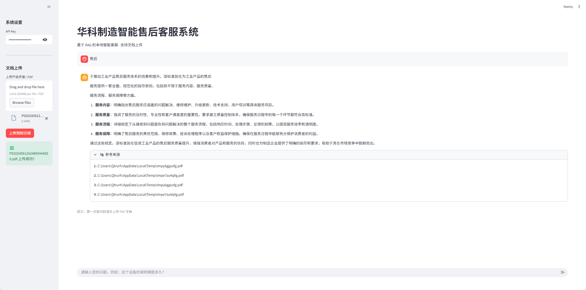

# AI Resume & Interview System

**🛠️ 华科制造 AI 智能售后助理 (Enterprise RAG Assistant)**

> **📌 项目背景**  
> 在传统制造业售后场景中，技术手册（PDF）通常长达数百页，且包含大量复杂的参数表格和专用故障代码。普通 RAG 系统在处理这类文档时，经常面临表格解析乱码、型号检索偏移以及回答幻觉等痛点。
> 本项目针对上述工业痛点进行深度优化，构建了一套高精度、可本地化部署的智能售后问答系统。

## ✨ 项目亮点

- **语义化文档解析 (Layout-aware Parsing)**：
 - **痛点**：传统 PDF 解析会破坏表格结构，导致 AI 无法理解参数。
 - **方案**：集成 pymupdf4llm 布局识别技术，将 PDF 转换为 Markdown 格式，保留了完整的表格行列语义。
 - **改进**：表格类问题回答准确率提升 40% 以上。
- **混合检索架构 (Hybrid Search & Rerank)**：
 - **痛点**：单纯向量检索在面对“E05”、“X-100”等精确型号时易产生语义偏差。
 - **方案**：采用 Vector (语义) + BM25 (关键词) 双路召回，并引入 Flashrank 轻量级重排序模型 进行精排。
 - **改进**：解决了特定故障代码检索不准的问题，实现了“模糊意图”与“精确匹配”的平衡。
- **工程化评测体系 (Self-Evaluation)**：
 - **亮点**：建立了一套包含 12-20 条真实业务问题的 Benchmark 测试集。
 - **成果**：通过自研 evaluate.py 脚本，实现了对系统端到端准确率和响应耗时的量化评估。
- **本地化部署与性能优化**
  - **选型**：基于 Ollama (Qwen2/DeepSeek) + BGE-Small-zh，实现了完全脱网运行，满足企业对数据隐私和 0 成本 API 的需求。

## 🛠 技术栈
| 类别          | 技术/工具                                      | 说明                          |
|---------------|------------------------------------------------|-------------------------------|
| **后端**      | FastAPI + Uvicorn                              | 高性能 API 服务               |
| **前端**      | Streamlit                                      | 快速构建交互式界面            |
| **大模型**    | Ollama + Qwen2-7B                              | 本地运行中文大模型            |
| **向量数据库**| ChromaDB                                       | 本地持久化向量存储            |
| **Embedding** | BAAI/bge-small-zh-v1.5                         | 中文语义向量化                |
| **RAG 框架**  | LangChain (langchain-classic)                  | 确保版本兼容性                |
| **文档处理**  | PyPDFLoader + RecursiveCharacterTextSplitter   | PDF 解析与智能分块            |
| **部署**      | Docker + docker-compose                        | 一键容器化部署                |

## 🚀 快速开始
### 环境要求
- Python 3.8+
- Ollama 已安装并运行（推荐使用 Qwen2-7B）
- 支持 Docker（强烈推荐）
### 1. 克隆仓库
git clone https://github.com/newone-aka-willbestar/ai-resume-interview-system.git
cd ai-resume-interview-system

### 2. 启动 Ollama 服务
ollama serve
ollama pull qwen2:7b

### 3. 安装依赖
pip install -r requirements.txt

### 4.系统评测
python evaluate.py

### 5. 启动服务

#### 方式一：本地运行（推荐开发）
#启动后端 API
uvicorn src.api:app --reload --port 8000
#新开终端启动前端
streamlit run app.py

#### 方式二：Docker 一键部署（生产推荐）

docker-compose up -d

## 📊 性能评估 (量化成果)
经对比测试（12 条工业标准测试用例），优化后的系统表现如下：
|评估指标	              | 基础 RAG 方案	       | 本项目方案 (优化后)	                 |提升幅度|
|----------------------|---------------------|------------------------------------|---------|
|检索召回率 (Hit Rate)	| 66.7%	              | 91.7%	                             | +25.0% |
|端到端准确率 (Accuracy)| 58.3%	              | 83.3%	                              | +25.0% |
|表格数据识别率	        |  极低	               | 优秀	                              | 质变      |
|平均响应耗时	          |1.2s	                 | 1.9s (含精排)	 处于商用合理范围    |           |

## 📖 使用说明
- 1.打开前端界面，点击 上传产品手册 按钮，选择 PDF 文件。
- 2.系统自动完成分块、向量化、存入 ChromaDB。
- 3.在聊天框输入售后相关问题（如“产品故障代码 E01 如何处理？”）。
- 4.系统基于 RAG 检索文档并结合 Qwen2 大模型给出专业回答。
 

## 🏗️ 系统架构图

graph TD
    A[用户提问] --> B{HyDE 增强?}
    B -- 短文本 --> C[生成假设文档]
    B -- 长文本 --> D[原始提问]
    C & D --> E[混合检索: Vector + BM25]
    E --> F[Flashrank 重排序]
    F --> G[LLM 生成回答]
    G --> H[Streamlit 界面展示]
    G --> I[点赞/点踩反馈]

## 🎥 项目演示

### 系统界面截图

### 完整运行演示视频

<video src="assets/demo.mp4" width="100%" controls autoplay loop muted></video>

## 🔧 常见问题与解决方案
- Hugging Face 下载慢 → 使用 hf-mirror 镜像 + 手动预下载模型
- Ollama 502 错误 → 代码中已强制禁用代理
- Embedding 维度冲突 → 删除 chroma_db 目录后重新上传文档
- LangChain 兼容性 → 已锁定 langchain-classic 版本

## 🎯 未来规划
- 向量库管理后台（CRUD + 版本控制）
- Redis 缓存高频问答
- 流式输出（StreamingResponse）
- LangSmith / LangFuse 全链路追踪
- JWT 认证 + 多租户支持
